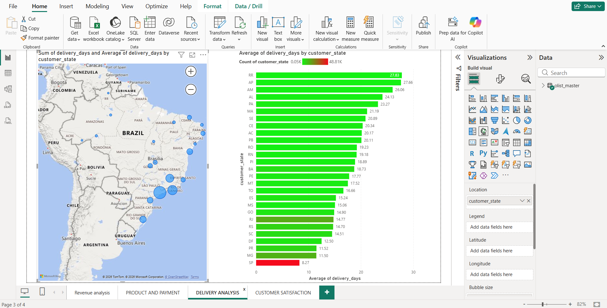
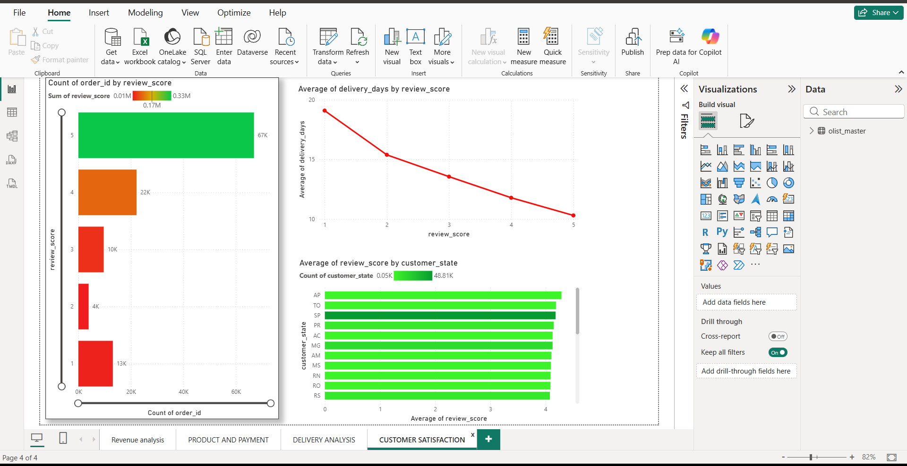

# 📊 Brazilian E-commerce Sales Analysis

## 📌 Project Overview
Performed end-to-end analysis on 115K+ Brazilian e-commerce orders dataset to uncover insights related to revenue, product performance, delivery efficiency, and customer satisfaction.

---

## 📊 Dashboard Preview

### 🔹 Revenue Analysis

### 🔹 Product & Payment Analysis

### 🔹 Delivery Analysis

### 🔹 Customer Satisfaction

---

## 🛠 Tools Used
- Python (Pandas, NumPy)
- SQL (MySQL)
- Power BI

---

## 📈 Key Insights
- Total revenue reached **13.88M** across all orders  
- Credit card dominates payment methods (~73%)  
- Top categories: Health & Beauty, Watches, Bed & Bath  
- Delivery delays vary significantly by state  
- Faster delivery leads to higher customer satisfaction  

---

## 📂 Project Files
- `brazilianEcommerce.ipynb` → Data cleaning & analysis  
- `brazilian_analysis.sql` → SQL queries  
- Power BI Dashboard (images + .pbix file)
